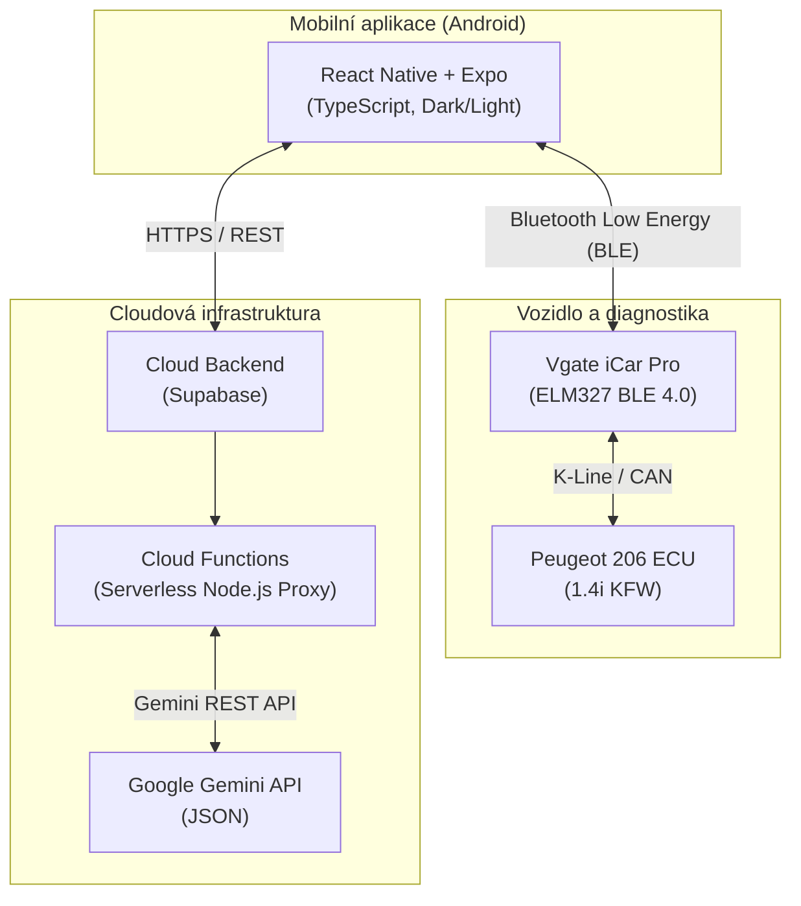

# Product Requirements Document (PRD): CarLogix

* **Projekt:** CarLogix
* **Autor:** Lukáš Černík
* **Cílová platforma:** Android (spustitelný balíček `.apk`)
* **Technologický stack:** React Native (Expo SDK, TypeScript), Supabase, Google Gemini API(Free tier), Bluetooth Low Energy (BLE 4.0+)
* **Referenční vozidlo:** Peugeot 206 1.4i (rok výroby 2006, motor KFW / TU3JP, protokol EOBD/OBD-II)
* **Časový rámec realizace:** Říjen – Únor (termín odevzdání hotového díla: polovina března)

---

## 1. Shrnutí a vize produktu (Executive Summary)

CarLogix je mobilní aplikace pro operační systém Android, která propojuje klasickou správu provozních nákladů motorového vozidla s diagnostickými daty z řídicí jednotky motoru (ECU) v reálném čase a moderními nástroji generativní umělé inteligence.

Projekt odstraňuje zásadní nedostatky starších automobilů (např. Peugeot 206 z roku 2006), které z výroby postrádají palubní počítač (okamžitá spotřeba, digitální ukazatele teploty či dojezdu). Dále digitalizuje servisní historii, eliminuje manuální přepisování tištěných faktur pomocí multimodálního OCR, zavádí prevenci proti nákupu nepasujících dílů (uživatelský Blacklist) a nabízí sdílený přístup pro servisní mechaniky.

Projekt splňuje všechna kritéria školní směrnice pro maturitní práce v oboru IT (kategorie Mobilní aplikace).

---

## 2. Soulad se směrnicí maturitních projektů (Project Terms)

* **Světlý a tmavý režim:** Plně dynamické přizpůsobení barevného tématu aplikace podle systémového nastavení zařízení uživatele (`useColorScheme`).
* **Ověřené přihlášení:** Autentizace založená na e-mailu a heslu s podmínkou povinného potvrzení e-mailové adresy před odemčením databáze.
* **Responzivita a adaptabilita:** Zajištění korektního vykreslení na netypických poměrech stran obrazovek (tablety, rozkládací telefony typu Galaxy Fold).
* **Přístupnost (Accessibility):** Striktní respektování systémové velikosti písma nastavené v operačním systému Android.
* **Podmínky používání (Terms of Service):** Samostatná, trvale přístupná obrazovka se zásadami ochrany osobních údajů a podmínkami užití umístěná přímo v rozhraní aplikace.
* **Formát odevzdání:** Vygenerovaný produkční instalační balíček ve formátu **APK**.
* **Archivace a udržitelnost:** Návrh cloudového backendu na bezplatné úrovni (Free Tier) garantující funkčnost aplikace minimálně 5 let od data obhajoby. Není potřeba aby byl backend, databáze dostupný na serveru po obhajobě, stačí databázi na Supabase a backend na školní server při obhajobě. Tzn. udělat export databáze, dát na flashku i GitHub.
* **Verzování kódu:** Průběžná správa zdrojového kódu v systému Git (GitHub) s konvencí smysluplných commitů.

---

## 3. Uživatelské role a řízení oprávnění (RBAC)

Aplikace funguje na bázi **jednoho kombinovaného účtu s přepínatelným pracovním kontextem** přímo v profilu uživatele:

### Osobní režim (Běžný řidič)
* Správa vlastní garáže vozidel.
* Evidence záznamů o tankování, automatické výpočty nákladů a reálné průměrné spotřeby.
* Zápis servisních oprav, nahrávání faktur přes fotoaparát a správa Blacklistu náhradních dílů.
* Generování párovacího kódu nebo QR kódu pro udělení přístupu mechanikovi či jiné osobě.

### Pracovní režim (Mechanik / Servisní dílna)
* Uživatel si v profilu aktivuje volbu *Režim dílny* a zadá název své provozovny.
* Zpřístupní se seznam klientských vozidel, ke kterým mu jejich majitelé potvrdili přístup.
* Mechanik může provést diagnostiku chybových kódů (DTC), zapsat servisní úkon s označením servisu a odeslat jej majiteli vozidla ke schválení do digitální servisní knihy.

---

## 4. Funkční specifikace modulů (Functional Requirements)

### FR1: Garáž vozidel a sdílení (Multi-tenancy)
* Ukládání identifikačních údajů: VIN, značka, model, rok výroby, kód motoru (KFW), typ paliva, SPZ a stav tachometru.
* Správa přístupových rolí ke sdílenému vozu:
  * `owner` – vlastník: plná správa, mazání vozidla, přidělování práv.
  * `editor` – správce: právo zápisu servisních úkonů a tankování.
  * `viewer` – čtenář: pasivní nahlížení do servisní historie a telemetrie.
* Stavový systém žádostí o sdílení: `pending` => `approved` / `rejected`.

### FR2: Modul tankování a kalkulace provozních nákladů
* Vstupní pole formuláře: datum, stav tachometru, natankované litry, cena za litr, celková platba v CZK, přepínač plné nádrže.
* Algoritmické výpočty:
  * Dlouhodobá reálná průměrná spotřeba (l/100km) počítaná metodou plná-plná.
  * Finanční provozní náklad na 1 ujetý kilometr (CZK/km).
  * Plánovač trasy: odhad celkových finančních nákladů na cestu ze zadané vzdálenosti.

### FR3: Servisní kniha a Blacklist náhradních dílů
* Servisní deník: historie oprav, rozpad nákladů na cenu materiálu a cenu práce, evidence ujetých kilometrů.
* Blacklist dílů: katalog nevyhovujících autodílů obsahující značku výrobce, katalogový kód, popis závady či důvod nekompatibility a fotodokumentaci.
* Digitální archiv dokumentů: cloudové úložiště fotografií technického průkazu, zelené karty a kupních smluv.

### FR4: Multimodální AI vytěžování faktur a STK (Gemini Vision)
* Pořízení fotografie faktury nebo protokolu STK systémovým fotoaparátem (`expo-camera`).
* Zpracování obrazu přes cloudovou funkci (Node.js Proxy) komunikující s Google Gemini.
* Automatická extrakce klíčových dat do strukturovaného JSON:
  * *Servisní faktury:* datum opravy, položky vyměněných dílů, cena práce, celková fakturovaná částka v CZK.
  * *Dokumenty STK:* datum vypršení platnosti technické kontroly a VIN vozu.
* Automatické předvyplnění formuláře aplikace s možností uživatelské kontroly před uložením.

### FR5: Inteligentní vyhledávání dílů dle motorizace (Gemini JSON)
* Vyhledávání náhradních dílů na základě specifikace vozidla z profilu (Peugeot 206 1.4i 55 kW r.v. 2006 KFW).
* Volání Gemini API přes zabezpečenou Cloud Function s vynuceným schématem JSON Structured Output:
  * `brand`: Doporučený ověřený výrobce dílu (např. Bosch, Valeo, Brembo).
  * `oemCode`: Originální výrobní kód dílu dle koncernu PSA.
  * `partNumber`: Katalogové označení konkrétního výrobce.
  * `technicalSpecs`: Technické parametry (rozměry, tolerance, typ brzdového systému).
  * `searchQueryUrl`: Vygenerovaný odkaz pro vyhledání dílu na českých e-shopech dle OEM kódu.
* Automatické porovnání nalezeného dílu proti uživatelskému Blacklistu s varovným upozorněním v případě shody.
* V případě nejistoty, či složitějšímu dotazu, upozornění uživatele na manuální kontrolu kompatibility dílu s vozidlem. 

### FR6: OBD-II Telemetrie a palubní počítač (HUD)
* Bezdrátová komunikace s adaptérem Vgate iCar Pro Bluetooth 4.0 přes BLE knihovnu `react-native-ble-plx`.
* Inicializace sériové linky AT příkazy adaptéru ELM327 (`ATZ`, `ATE0`, `ATL0`, `ATSP0`).
* Cyklické dotazování standardních OBD-II PID parametrů:
  * `010C` – Otáčky motoru (RPM).
  * `010D` – Rychlost vozidla (km/h).
  * `0105` – Teplota chladicí kapaliny motoru (°C).
  * `010B` / `0110` – Tlak v sacím potrubí (MAP) / Hmotnostní průtok vzduchu (MAF).
* **Matematický výpočet okamžité spotřeby paliva:**
  * Získání hmotnosti nasátého vzduchu (MAF v g/s) přímo nebo dopočtem z tlaku v sání MAP, otáček a teploty vzduchu.
  * Přepočet na spotřebovaný benzín při stechiometrickém poměru 14,7 : 1:
    Palivo [g/s] = MAF / 14,7
  * Přepočet na objem přes hustotu benzínu (745 g/l):
    Spotřeba [l/s] = Palivo [g/s] / 745
  * Okamžitá spotřeba za jízdy (v > 0 km/h):
    Spotřeba [l/100 km] = (Spotřeba [l/s] * 3600 / v) * 100
  * Okamžitá spotřeba na volnoběh při stání (v = 0 km/h):
    Spotřeba [l/h] = Spotřeba [l/s] * 3600
* **Head-Up Display (HUD Režim):**
  * Vysoce kontrastní noční zobrazení palubních budíků na černém pozadí.
  * Možnost horizontální rotace displeje (`transform: [{ scaleX: -1 }]`) pro promítání na čelní sklo automobilu.

### FR7: OBD-II Diagnostika motoru (DTC Scanner)
* Vyčítání uložených diagnostických chybových kódů motoru (Mode 03).
* Parsování hexadecimálního řetězce na standardní SAE kód závady (např. `P0300`).
* Zobrazení popisu poruchy v českém jazyce s doporučeným postupem opravy.
* Vymazání paměti závad z řídicí jednotky motoru a zhasnutí výstražné kontrolky motoru MIL (Mode 04).

### FR8: Softwarový simulační režim (Mock OBD)
* Interní přepínač v nastavení: `Zdroj telemetrie: BLE Adaptér / Simulační režim`.
* Generátor generující realistické hodnoty otáček, postupný ohřev motoru a proměnlivou rychlost pro demonstraci aplikace před maturitní komisí bez nutnosti přítomnosti vozidla.
* Možnost simulace výskytu a smazání diagnostické chyby DTC.

### FR9: Lokální notifikační systém
* Běh notifikací přes modul `expo-notifications` bez nutnosti provozovat externí push server.
* Časové notifikace: 30 dní a 7 dní před vypršením platnosti STK a povinného ručení.
* Kilometrové notifikace: odpočet ujetých kilometrů do intervalu výměny motorového oleje, vzduchového filtru a rozvodové sady.

---

## 5. Architektura systému a technologický stack



* **Frontend:** React Native (Expo SDK 57+), TypeScript, React Navigation.
* **Styling a UI:** NativeWind (Tailwind CSS) s dynamickým přepínáním režimů a podporou font scalingu.
* **Hardware komunikace:** `react-native-ble-plx` pro nízkoúrovňový přenos dat přes GATT rozhraní.
* **Offline mezipaměť:** MMKV / AsyncStorage pro lokální ukládání dat při výpadku sítě.
* **Backend:** Supabase Auth pro správu uživatelů a PostgreSQL pro ukládání dat.
* **Serverless proxy:** Node.js Cloud Functions chránící privátní klíč k API.
* **Build nástroj:** EAS Build (Expo Application Services) pro kompilaci balíčku `.apk`.

---

## 6. Databázový model (Schéma entit)

```typescript
// Uživatelé a profily
interface User {
  id: string;
  email: string;
  emailVerified: boolean;
  displayName: string;
  isMechanic: boolean;
  workshopName?: string;
  createdAt: string;
}

// Garáž vozidel
interface Vehicle {
  id: string;
  ownerId: string;
  brand: string;            // "Peugeot"
  model: string;            // "206"
  year: number;             // 2006
  engineCode: string;       // "KFW"
  fuelType: "petrol" | "diesel" | "lpg" | "cng" | "hybrid" | "electric";
  currentOdometer: number;  // v kilometrech
  vin?: string;
  licensePlate: string;
  stkExpirationDate: string;
  insuranceExpirationDate: string;
  oilIntervalKm: number;    // např. 15000
  lastOilChangeKm: number;
}

// Oprávnění a sdílení vozidel (RBAC)
interface VehicleAccess {
  id: string;
  vehicleId: string;
  userId: string;
  role: 'owner' | 'editor' | 'viewer';
  status: 'pending' | 'approved' | 'rejected';
  grantedAt: string;
}

// Evidence tankování
interface FuelEntry {
  id: string;
  vehicleId: string;
  userId: string;
  date: string;
  odometer: number;
  liters: number;
  priceTotalCzK: number;
  pricePerLiter: number;
  isFullTank: boolean;
  calculatedConsumption?: number; // v l/100 km
}

// Servisní kniha a deník oprav
interface ServiceEntry {
  id: string;
  vehicleId: string;
  authorId: string;
  authorRole: 'owner' | 'mechanic';
  workshopStamp?: string;
  date: string;
  odometer: number;
  title: string;
  description: string;
  partsReplaced: Array<{
    name: string;
    brand: string;
    partNumber: string;
    priceCzK: number;
  }>;
  laborPriceCzK: number;
  totalPriceCzK: number;
  invoiceImageUrl?: string;
  isConfirmedByOwner: boolean;
}

// Blacklist dílů
interface BlacklistedPart {
  id: string;
  vehicleId: string;
  userId: string;
  category: string;         // např. "Zapalovací cívka"
  brand: string;            // např. "Starline"
  partNumber?: string;
  reason: string;           // Popis závady nebo důvod, proč díl nepasoval
  createdAt: string;
}

---

## 7. Nefunkční požadavky a bezpečnost

* **Zabezpečení API klíčů:** Klientská aplikace v APK balíčku nesmí obsahovat soukromý API klíč k Google Gemini. Všechny dotazy procházejí přes autorizovanou cloudovou proxy funkci.
* **Offline odolnost:** Výpadek mobilního signálu za jízdy neomezuje chod aplikace. Telemetrie se zapisuje do lokální paměti zařízení a synchronizuje se po obnovení sítě.
* **Chybová tolerance sběrnice:** Aplikace reaguje na vypnutí zapalování vozu či vytažení adaptéru plynulým přechodem do stavu čekání na opětovné spojení bez pádu prostředí.
* **Udržitelnost po dobu 5 let:** Databázové i serverless služby jsou navrženy v bezplatných limitech tak, aby byl projekt spustitelný a dostupný minimálně 5 let po maturitní obhajobě.

---

## 8. Harmonogram (Říjen – Únor)

Cíle:

### Říjen
* Implementace navigace a základní kostry aplikace.
* Světlý a tmavý režim dle nastavení systému.
* Autentizace uživatelů s e-mailovým ověřením.
* Návrh a vytvoření databázových kolekcí pro uživatele a vozidla.

### Listopad
* Modul tankování (výpočet reálné průměrné spotřeby a nákladů na trasu).
* Servisní kniha (včetně modulu Blacklist nekvalitních/nepasujících dílů).
* Skenování dokumentů přes fotoaparát (digitalizace faktur a podkladů).
* Automatické vytěžování dat z faktur pomocí AI (nastavení funkce pro rozpoznání klíčových údajů).

### Prosinec
* Implementace BLE komunikace s diagnostickým adaptérem (skenování, párování a čtení GATT služeb).
* Modul pro řízení a zpracování komunikace s ELM327 (inicializace pomocí AT příkazů a parsování dat ze sběrnice).
* Čtení živých dat motoru (otáčky, teplota kapaliny a rychlost).
* Softwarový simulační režim telemetrie (Mock OBD pro testování a pololetní obhajobu bez přítomnosti vozu).

### Leden
* Tvorba uživatelského rozhraní palubních budíků v reálném čase (včetně nočního HUD zrcadlení).
* Implementace algoritmického výpočtu okamžité spotřeby paliva (l/100 km, l/h).
* Modul čtení a mazání chybových kódů řídicí jednotky (DTC Mode 03 a 04).
* Lokální push notifikace (upozornění na blížící se STK a servisní intervaly).

### Únor
* Vyhledávání náhradních dílů pomocí AI (generování kompatibilních dílů na základě motorizace vozu).
* Rozšíření správy uživatelských rolí a přístupů (sdílení vozidel a dedikovaný servisní profil pro mechaniky).
* Obrazovka Podmínek používání a zásad ochrany soukromí uvnitř aplikace.
* Vygenerování produkčního instalačního balíčku ve formátu APK přes EAS Build.

---

## 9. Scénáře a strategie pro obhajoby

### Pololetní obhajoba (Leden)
* Prezentace splnění formálních požadavků školní směrnice (světlý/tmavý režim, ověřený login, responzivita a škálování písma).
* Praktická ukázka vytěžení údajů z vyfotografované servisní faktury přes Google Gemini Vision.
* Předvedení funkčních palubních budíků v aplikaci spuštěné v interním simulačním režimu (Mock OBD).

### Závěrečná maturitní obhajoba (Květen)
* Prezentace zkompilované aplikace spuštěné z vygenerovaného APK souboru na fyzickém telefonu se systémem Android.
* Promítnutí videozáznamu pořízeného přímo v testovacím voze Peugeot 206 1.4i za reálné jízdy jako doklad funkčnosti hardwarového spojení.
* Předvedení přepnutí role do servisního režimu mechanika a autorizace servisního záznamu majitelem vozu.
* Obhajoba technické náročnosti: vysvětlení funkce parseru hexadecimálních OBD-II zpráv a matematických vzorců pro výpočet spotřeby paliva.
* Odevzdání svázané tištěné dokumentace v kroužkové vazbě v rozsahu 12–35 normostran zpracované dle normy ČSN ISO 690 a šablony školy.
